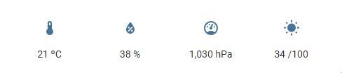
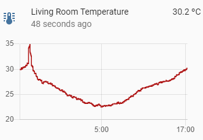

# KX IoT with MQTT

* [KX IoT with MQTT](#kx-iot-with-mqtt)
  * [What is MQTT](#what-is-mqtt)
  * [Sections](#sections)
* [Install and setup](#install-and-setup)
  * [Install and test a broker](#install-and-test-a-broker)
  * [Install kdb+](#install-kdb)
  * [Install the KX MQTT interface](#install-the-kx-mqtt-interface)
  * [Test the KX MQTT interface](#test-the-kx-mqtt-interface)
* [Reading sensor data](#reading-sensor-data)
  * [Read serial data with kdb+](#read-serial-data-with-kdb)
  * [Calculate an error detecting checksum](#calculate-an-error-detecting-checksum)
* [Publishing data to an IoT platform](#publishing-data-to-an-iot-platform)
  * [Home Assistant](#home-assistant)
  * [Configuring sensors](#configuring-sensors)
  * [QoS](#qos)
  * [Retained messages](#retained-messages)
  * [Retaining flexibility](#retaining-flexibility)
  * [Publishing updates](#publishing-updates)
  * [Reducing data volume](#reducing-data-volume)
  * [Home Assistant UI](#home-assistant-ui)
* [Creating a sensor database](#creating-a-sensor-database)
  * [Subscribing to data in kdb+](#subscribing-to-data-in-kdb)
  * [Storing MQTT sensor data](#storing-mqtt-sensor-data)
    * [Storing config data](#storing-config-data)
    * [Storing state data](#storing-state-data)
    * [Persisting data to disk](#persisting-data-to-disk)
* [Creating a query API](#creating-a-query-api)
* [Conclusion](#conclusion)
  * [Relevant Links](#relevant-links)
  * [Other publications by the author](#other-publications-by-the-author)

## What is MQTT

[MQTT](http://mqtt.org/) is a messaging protocol for the Internet of Things (IoT). It was designed as an extremely lightweight publish/subscribe messaging transport. It is useful for connections with remote locations where a small code footprint is required and/or network bandwidth is at a premium.

KX have  released an MQTT interface. Documented on [code.kx.com](https://code.kx.com/q/interfaces/mqtt/) with source code available on [Github](https://github.com/KXSystems/mqtt). The interface supports Linux/Mac/Windows platforms.

For examples in this paper a Raspberry Pi 3 Model B+ has been chosen as a host. This is a low powered single board computer which is suitable as an edge computing host. The Linux ARM 32-bit release of kdb+ enables it to run on the Raspberry Pi.

## Sections

1. [Install and setup](#install-and-setup)
2. [Reading sensor data](#reading-sensor-data)
3. [Publishing data to an IoT Platform](#publishing-data-to-an-iot-platform)
4. [Creating a sensor database](#creating-a-sensor-database)
5. [Creating a query API](#creating-a-query-api)
6. [Conclusion](#conclusion)

# Install and setup

## Install and test a broker

An MQTT broker is a process that receives all messages from the clients and then routes the messages to the appropriate destination clients.
[Eclipse Mosquitto](https://mosquitto.org/) is one of [many](https://github.com/mqtt/mqtt.github.io/wiki/brokers) implementations. We will use it for our example.

Install the broker with:

```bash
sudo apt-get install mosquitto
```

To test the broker install the command line tools:

```bash
sudo apt-get install mosquitto-clients
```

In one shell subscribe to messages on the `test` topic:

```bash
mosquitto_sub -h localhost -t test
```

In another shell publish a message on the same topic:

```bash
mosquitto_pub -h localhost -t test -m "hello"
```

You should see `hello` print to the subscriber shell.

## Install kdb+

Download the [Linux-ARM](https://kx.com/download/) version of kdb+ 32-bit and follow the install [instructions](
https://code.kx.com/q/learn/install/linux/). Making sure to rename `l32arm` to `l32` during install:

```bash
unzip linuxarm.zip
mv q/l32arm q/l32
mv q ~/
```

Add `QHOME` to your `.bashrc`:

```bash
export PATH="$PATH:/home/pi/q/l32"
export QHOME="/home/pi/q"
```

## Install the KX MQTT interface

Full instructions for all platforms are on [Github](https://github.com/KXSystems/mqtt).
Other platforms have fewer steps as there are pre compiled releases. For ARM we will compile from source.

Install the dependencies which are needed to compile the projects:

```bash
sudo apt-get install libssl-dev cmake
```

The [Paho MQTT C client library](https://www.eclipse.org/paho/files/mqttdoc/MQTTClient/html/index.html) needs to be available before the kdb+ can be compiled.
Take the link to the latest source code for the `paho.mqtt.c` library from it's [releases](https://github.com/eclipse/paho.mqtt.c/releases) tab on Github.

```bash
mkdir paho.mqtt.c
wget https://github.com/eclipse/paho.mqtt.c/archive/v1.3.8.tar.gz
tar -xzf v1.3.8.tar.gz -C ./paho.mqtt.c --strip-components=1
cd paho.mqtt.c
make
sudo make install
export BUILD_HOME=$(pwd)
```

Now the system is ready for the KX MQTT interface to be installed. Use it's [releases](https://github.com/KXSystems/mqtt/releases) tab on Github to find a link to the latest available.

```bash
wget -O mqtt.tar.gz https://github.com/KxSystems/mqtt/archive/1.0.0.tar.gz
tar -xzf mqtt.tar.gz
cd mqtt-1.0.0
mkdir cmake && cd cmake
cmake ..
make
make install
cd ..
cp q/mqtt.q $QHOME/
cp cmake/mqtt.so $QHOME/l32/
```

## Test the KX MQTT interface

Start a q process and subscribe to the `test` topic:

```q
q)\l mqtt.q /Load the interface
q).mqtt.conn[`localhost:1883;`src;()!()] /Connect to the broker
q).mqtt.sub[`test] /Subscribe to the test topic
```

Publish a message. The default message receive [function](https://code.kx.com/q/interfaces/mqtt/reference/#mqttmsgrcvd) will print the incoming message:

```q
q).mqtt.pub[`test;"hello"] /Publish to the test topic
2
q)(`msgsent;2)
(`msgrecvd;"test";"hello")
```

More examples are included on [code.kx.com](https://code.kx.com/q/interfaces/mqtt/examples/)

# Reading sensor data

For a simple example project we will collect some sensor data and publish it to an IoT platform.
The full project is available on [Github](https://github.com/rianoc/EnvironmentalMonitor).


The data source will be an [Arduino](https://www.arduino.cc/) microcontroller. Temperature, pressure, humidity and light readings will be read by kdb+ over a serial USB connection.


## Read serial data with kdb+

Reading the serial data in kdb+ is quick using [named pipe](https://code.kx.com/q/kb/named-pipes/) support:

```q
q)ser:hopen`$":fifo://",COM
q)read0 ser
"26.70,35,736,1013,-5.91,26421"
```

The comma separated field contain:

1. Temperature - Celsius
1. Humidity - Percent
1. Light - Analog value between 0 and 1023
1. Pressure - Pa
1. Altitude - m (Not accurate)
1. CRC-16 - checksum of data fields

## Calculate an error detecting checksum

The final field is particularly important. This is a [checksum](https://en.wikipedia.org/wiki/Cyclic_redundancy_check) which enables error-detection, a requirement as serial data can be unreliable. Without this incorrect data could be interpreted as correct. For example a temperature reading such as `26.70` missing it's decimal point would be published as `2670`.

In kdb+ a function is needed to generate a checksum to compare against the one sent by the Arduino. If the two values do not match the data is rejected as it contains an error.

To create the function the logic from C functions [crc16_update](https://www.nongnu.org/avr-libc/user-manual/group__util__crc.html#ga95371c87f25b0a2497d9cba13190847f) and [calcCRC](https://github.com/rianoc/Arduino/blob/39539f3352771bb879ec47dc2cdd6dc7aab369bc/EnvironmentalMonitor/EnvironmentalMonitor.ino#L58) was created as `crc16`. The [over](https://code.kx.com/q/ref/over/) accumulator was used in place of `for` loops:

```q
rs:{0b sv y xprev 0b vs x} /Right shift
ls:{0b sv neg[y] xprev 0b vs x} /Left shift
xor:{0b sv (<>/)vs[0b] each(x;y)} /XOR
land:{0b sv (.q.and). vs[0b] each(x;y)} /Logical AND

crc16:{
 crc:0;
 {x:xor[x;y];
  {[x;y] $[(land[x;1])>0;xor[rs[x;1];40961];rs[x;1]]} over x,til 8
 } over crc,`long$x
 };
```

In this example pressure can be seen to have arrived incorrectly as `101020` rather than `1020`:

```txt
Error with data: "26.30,36,739,101020,-56.88,17352" 'Failed checksum check
```

# Publishing data to an IoT platform

## Home Assistant

[Home Assistant](https://www.home-assistant.io/) is a home automation platform. To make the sensor data captured available to Home Assistant it can be published over MQTT.

## Configuring sensors

On any IoT platform metadata is needed about sensors such as their name and unit of measure.
Home Assistant includes [MQTT Discovery](https://www.home-assistant.io/docs/mqtt/discovery/) to allow sensors to configure themselves. This is a powerful feature as a sensor can send rich metadata once allowing for subsequent sensor state updates packets to be small. This helps to reduce bandwidth requirements which in IoT environment is important.

For this project we will use a table to store metadata:

```q
q)sensors
name        class       unit        icon                 
---------------------------------------------------------
temperature temperature "ºC"        ""                   
humidity    humidity    "%"         ""                   
light                   "/100"     "white-balance-sunny"
pressure    pressure    "hPa"       ""                   
```

* `name` - The name of the sensor
* `class` - Home Assistant has some predefined [classes](https://www.home-assistant.io/integrations/sensor/#device-class) of sensor.
* `unit` - the unit of measure of the sensor
* `icon` - An icon can be chosen for the UI.

As our light sensor does not fall in to a known `class` it's value is left as null and we must chose an `icon` as without a default `class` one will not be automatically populated.

Now that we have defined out metadata we are required to publish it. MQTT uses a hierarchy of topics when data is published. To configure a home assistant sensor a message must arrive on a topic of the structure:

```
<discovery_prefix>/<component>/[<node_id>/]<object_id>/config
```

An example for humidity sensor would be:

```
homeassistant/sensor/livingroomhumidity/config
```

The payload we publish on this topic will include our metadata along with some extra fields.

* `unique_id` - A unique ID is important throughout IoT systems to allow metadata to be related to sensor data
* `state_topic` - The sensor here is announcing that any state updates will arrive on this topic.
* `value_template`- This template enables the system to extract the sensor value from the payload

A populated JSON config message for the humidity sensors:

```json
{
  "device_class":"humidity",
  "name":"humidity",
  "unique_id":"livingroomhumidity",
  "state_topic":"homeassistant/sensor/livingroom/state",
  "unit_of_measurement":"%",
  "value_template":"{{ value_json.humidity}}"
}
```

The `configure` function publishes a config message for each sensor in the table. It builds up the dictionary of information and uses [.j.j](https://code.kx.com/q/ref/dotj/#jj-serialize) to serialise to JSON before publishing:

```
configure:{[s]
  msg:(!). flip (
   (`name;room,string s`name);
   (`state_topic;"homeassistant/sensor/",room,"/state");
   (`unit_of_measurement;s`unit);
   (`value_template;"{{ value_json.",string[s`name],"}}"));
   if[not null s`class;msg[`device_class]:s`class];
   if[not ""~s`icon;msg[`icon]:"mdi:",s`icon];
   topic:`$"homeassistant/sensor/",room,msg[`name],"/config";
   .mqtt.pubx[topic;;1;1b] .j.j msg;
 }

configure each sensors;
```

Note that [.mqtt.pubx](https://code.kx.com/q/interfaces/mqtt/reference/#mqttpubx) rather than the default `.mqtt.pub` is used to set QoS to `1` and Retain to true (`1b`) for these configuration messages.

```q
.mqtt.pubx[topic;;1;1b]
```

## QoS

Quality of Service (QoS) is an important feature. There are 3 QoS levels in MQTT:

* At most once (0)
* At least once (1)
* Exactly once (2).

To be a lightweight system MQTT will default to a fire and forget approach to sending messages QoS 0. This may be suitable for temperature updates in our system as one missed update will not cause any issues. However for our configuration of sensors we do want to ensure this information arrives. In this case we choose QoS 1. QoS 2 has more overheard than 1 and here is of no benefit as there is no drawback to configuring a sensor twice.

## Retained messages

Unlike other messaging systems such as a kdb+ [Tickerplant](https://code.kx.com/q/learn/startingkdb/tick/#tickerplant), [Kafka](https://code.kx.com/q/interfaces/kafka/), or [Solace](https://code.kx.com/q/interfaces/solace/) MQTT does not retain logs of all data that flows through the broker. This makes sense as the MQTT broker should be lightweight and able to run on an edge device with slow and limited storage. Also in a bandwidth limited environment attempting to replay large logs could interfere with the publishing of the more important real-time data.
The MQTT spec does however allow for a single message to be retained per topic. Importantly what this allows for is that our downstream clients no matter when they connect will receive the configuration metadata of our sensors.

## Retaining flexibility

Reviewing our `sensors` table and `configure` function we can spot some patterns. Optional configuration variables such as `icon` tend to be sparsely populated in the table and require specific `if` blocks in our `configure` function. Further reviewing the [MQTT Sensor](https://www.home-assistant.io/integrations/sensor.mqtt/) specification we can see there are a total of 26 optional variables. If we were to support all of these our table would be extremely wide and sparsely populated and the `configure` function would need 26 `if` statements. This is clearly something to avoid. Furthermore if a new optional variable was added to the spec we would need to update our full system and database schema.

This example shows the importance of designing an IoT system for flexibility. When dealing with many vendors and specifications the number of possible configurations is huge.

To address this in our design we change our table to move all optional parameters to an `opts` column which stores the values in dictionaries.

```q
sensors:([] name:`temperature`humidity`light`pressure;
            opts:(`device_class`unit_of_measurement!(`temperature;"ºC");
                  `device_class`unit_of_measurement!(`humidity;"%");
                  `unit_of_measurement`icon!("/100";"white-balance-sunny");
                  `device_class`unit_of_measurement!(`pressure;"hPa"))
 )
```

Doing this allows the sensors to include any optional variable they wish and we do not need to populate any nulls.

```q
name        opts                                                            
----------------------------------------------------------------------------
temperature `device_class`unit_of_measurement!(`temperature;"\302\272C")
humidity    `device_class`unit_of_measurement!(`humidity;"%")           
light       `unit_of_measurement`icon!("/100";"white-balance-sunny")    
pressure    `device_class`unit_of_measurement!(`pressure;"hPa")     
```

Our `configure` function is then simplified as there need not be any special handling of optional variables.

```q
configure:{[s]
  msg:(!). flip (
   (`name;room,string s`name);
   (`state_topic;"homeassistant/sensor/",room,"/state");
   (`value_template;createTemplate string[s`name]));
   msg,:s`opts;
   topic:`$"homeassistant/sensor/",msg[`name],"/config";
   .mqtt.pubx[topic;;1;1b] .j.j msg;
 }
```

## Publishing updates

Now that the sensors are configured the process runs a timer once per second to publish state updates.

1. Data is read from the serial port
2. The checksum value is checked for correctness.
3. The data is formatted and published to the `state_topic` we specified.

```q
pub:{[]
 rawdata:last read0 ser;
 if[any rawdata~/:("";());:(::)];
 @[{
    qCRC:crc16 #[;x] last where x=",";
    data:"," vs x;
    arduinoCRC:"J"$last data;
    if[not qCRC=arduinoCRC;'"Failed checksum check"];
    .mqtt.pub[`$"homeassistant/sensor/",room,"/state"] .j.j sensors[`name]!"F"$4#data;
   };
   rawdata;
   {-1 "Error with data: \"",x,"\" '",y}[rawdata]
  ];
 }

.z.ts:{
 if[not conn;connect[]];
 pub[]
 }

\t 1000
```

Here we use `.mqtt.pub` which defaults QoS to `0` and Retain to false (`0b`) as we these state updates are less important.

An example JSON message on the topic `homeassistant/sensor/livingroom/state`:

```json
{"temperature":21.4,"humidity":38,"light":44,"pressure":1012}
```

It can be noted here that we published a configure message per sensor but for state changes we are publishing a single message. This is chosen for efficiency to reduce the overall volume of messages the broker must relay. The `value_template` field we populated allows Home Assistant to extract the data for each sensor from the JSON dictionary. This allows for the number of sensors per update to be flexible.

## Reducing data volume

In our example we are publishing 4 values every seconds, in a day this is 86k updates resulting in 344k sensor values being stored in our database.
Many of these values will be repeated. As these are state changes and not events there is no value is storing repeats. In an IoT project for efficiency this should be addressed at the source and not the destination.
This edge processing is necessary to reduce the hardware and network requirements throughout the full stack.

The first step we take is to add a `lastPub` and `lastVal` column to our `sensors` metadata table:

```q
sensors:([] name:`temperature`humidity`light`pressure;
            lastPub:4#0Np;
            lastVal:4#0Nf;
            opts:(`device_class`unit_of_measurement!(`temperature;"ºC");
                  `device_class`unit_of_measurement!(`humidity;"%");
                  `unit_of_measurement`icon!("/100";"white-balance-sunny");
                  `device_class`unit_of_measurement!(`pressure;"hPa"))
 )
```

```q
name        lastPub lastVal opts                                                            
--------------------------------------------------------------------------------------------
temperature                 `device_class`unit_of_measurement!(`temperature;"\302\272C")
humidity                    `device_class`unit_of_measurement!(`humidity;"%")           
light                       `unit_of_measurement`icon!("/100";"white-balance-sunny")    
pressure                    `device_class`unit_of_measurement!(`pressure;"hPa")    
```

Then rather than publishing any new data from a sensor when available we instead pass it through a `filterPub` function.

From:

```q
.mqtt.pub[`$"homeassistant/sensor/",room,"/state"] .j.j sensors[`name]!"F"$4#data;
```

To:

```q
filterPub "F"$4#data;
```

The function will only publish data when either the sensor value changes or if 10 minutes has elapsed since the last time a sensor had an update published:

```q
filterPub:{[newVals]
 newVals:@[newVals;2;{`float$floor x%10.23}];
 now:.z.p;
 toPub:exec (lastPub<.z.p-0D00:10) or (not lastVal=newVals) from sensors;
 if[count where toPub;
    update lastPub:now,lastVal:newVals[where toPub] from `sensors where toPub;
    msg:.j.j exec name!lastVal from sensors where toPub;
    .mqtt.pub[`$"homeassistant/sensor/",room,"/state";msg];
  ];
 }
 ```

Setting the 10 minute minimum publish window is important to act as a heartbeat. This will ensure that the difference between a broken or disconnected sensor can be distinguished from a sensor whose value is simply unchanged over a large time window. Also considering MQTT does not retain values we wish to ensure any new subscribers will receive a timely update on the value of all sensors.

Now when we start our process there are fewer updates and only sensors with new values are included:

```
homeassistant/sensor/livingroom/state "{\"temperature\":21.1,\"humidity\":38,\"light\":24,\"pressure\":1002}"
homeassistant/sensor/livingroom/state "{\"light\":23}"
homeassistant/sensor/livingroom/state "{\"light\":24}"
homeassistant/sensor/livingroom/state "{\"pressure\":1001}"
homeassistant/sensor/livingroom/state "{\"temperature\":21.2,\"pressure\":1002}"
homeassistant/sensor/livingroom/state "{\"temperature\":21.1}"
```

The UI also needed more complex `value_template` logic in metadata to extract the data if present but use the prevailing state value if not.

From:

```
{{ value_json.pressure }}
```

To:

```

 {{ value_json.pressure }}

 {{ states('sensor.livingroompressure') }}

```

Rather than daily 86k updates resulting in 344k sensor values being stored in our database this small changes reduced those to 6k updates delivering 6.5k sensor values. Reducing updates by 93% and stored values by 98%!

## Home Assistant UI

Home Assistant includes a UI to view data. A display for the data can be configured in the UI or defined in YAML.

```yml
type: glance
entities:
  - entity: sensor.livingroomtemperature
  - entity: sensor.livingroomhumidity
  - entity: sensor.livingroompressure
  - entity: sensor.livingroomlight
title: Living Room
state_color: false
show_name: false
show_icon: true
```

An overview of all the sensors:



Clicking on any one sensor allows a more detailed graph to be seen:



# Creating a sensor database

## Subscribing to data in kdb+

Subscribing to the published data from another kdb+ process is quick. MQTT uses `/` to split a topic hierarchy and when subscribing `#` can be used to subscribe to all subtopics:

```q
q)\l mqtt.q
q).mqtt.conn[`localhost:1883;`src;()!()]
q).mqtt.sub[`$"homeassistant/#"]
```

Immediately on connection the broker publishes any Retained messages on topics:

```q
(`msgrecvd;"homeassistant/sensor/livingroomtemperature/config";"{\"device_class\":\"temperature\",\"name\":\"temperature\",\"unique_id\":\"livingroomtemperature\",\"state_topic\":\"homeassistant/sensor/livingroom/state\",\"unit_of_measurement\":\"\302\272C\",\"value_template\":\"{{ value_json.temperature}}\"}")
(`msgrecvd;"homeassistant/sensor/livingroomhumidity/config";"{\"device_class\":\"humidity\",\"name\":\"humidity\",\"unique_id\":\"livingroomhumidity\",\"state_topic\":\"homeassistant/sensor/livingroom/state\",\"unit_of_measurement\":\"%\",\"value_template\":\"{{ value_json.humidity}}\"}")
(`msgrecvd;"homeassistant/sensor/livingroomlight/config";"{\"device_class\":\"None\",\"name\":\"light\",\"unique_id\":\"livingroomlight\",\"state_topic\":\"homeassistant/sensor/livingroom/state\",\"unit_of_measurement\":\"hPa\",\"value_template\":\"{{ value_json.light}}\"}")
(`msgrecvd;"homeassistant/sensor/livingroompressure/config";"{\"device_class\":\"pressure\",\"name\":\"pressure\",\"unique_id\":\"livingroompressure\",\"state_topic\":\"homeassistant/sensor/livingroom/state\",\"unit_of_measurement\":\"/1024\",\"value_template\":\"{{ value_json.pressure}}\"}")
```

Following that any newly published messages will follow:

```
(`msgrecvd;"homeassistant/sensor/livingroom/state";"{\"temperature\":21.5,\"humidity\":38,\"light\":172,\"pressure\":1011}")
(`msgrecvd;"homeassistant/sensor/livingroom/state";"{\"temperature\":21.5,\"humidity\":37,\"light\":172,\"pressure\":1012}")
```

## Storing MQTT sensor data

Home Assistant does include an [SQLite](https://www.sqlite.org/index.html) embedded database for storing data. However it is not suitable for storing large amounts of historical sensor data.
Instead we can look to kdb+ to do this for us.

### Storing config data

...

### Storing state data

...

### Persisting data to disk

Extending again we can save data to disk daily. The historic data table is named `readingsHist`, this is done to keep the example simple. Both historic and real-time data can be queried within one process.

```q
day:.z.d
HDB:`:/home/pi/sensorHDB
.z.zd:17 2 6

.mqtt.msgrcvd:{
    now:.z.p;
    if[day<`date$now;
       .Q.dd[HDB;(`$string day;`readgingsHist;`)] set .Q.ens[HDB;readings;`sensors];
       `readings set 0#readings;
       day:`date$now;
       system"l ",string HDB;
     ];
    `readings insert .z.p,@[`$"/" vs x;1 2],"F"$y
    }
```

# Creating a query API

...

# Conclusion

The addition of an MQTT interface opens a huge range of possibilities.

## Relevant Links

* [KX POC Blog Series: Edge Computing on a Low-Profile Device](https://kx.com/blog/kx-poc-blog-series-edge-computing-on-a-low-profile-device/)

## Other publications by the author

* [Kdb+/q Insights: Parsing data in kdb+](https://kx.com/blog/kx-product-insights-parsing-data-in-kdb/)
* [Kdb+/q Insights: Parsing JSON files](https://kx.com/blog/kdb-q-insights-parsing-json-files/)
* [Partitioning data in kdb+](https://kx.com/blog/partitioning-data-in-kdb/)
* [How to Avoid a Goat in Monte Carlo – Elegantly](https://kx.com/blog/how-to-avoid-a-goat-in-monte-carlo-elegantly/)
